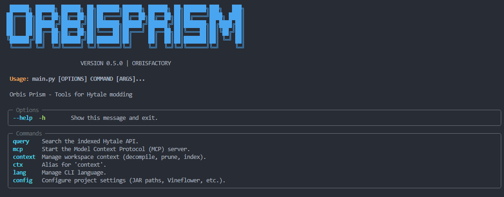

# 💎 Orbis Prism MCP

**[Read in English](README.md)**

> "Deconstruct the engine, illuminate the API."



**Orbis Prism** es una potente herramienta de análisis de SDK para desarrolladores de Hytale. Detecta automáticamente la instalación del juego, descompila la lógica del servidor y proporciona una interfaz inteligente lista para IA mediante el Model Context Protocol (MCP).

> [!IMPORTANT]
> **Orbis Prism** requiere una instalación oficial de Hytale. Esta herramienta no distribuye código fuente ni binarios del juego.

---

## 🚀 Inicio Rápido

1. **Instalar**
   Instala directamente desde PyPI:
   ```bash
   pip install orbis-prism
   ```
   *(O para desarrollo local: `pip install -e .`)*

2. **Inicializar Espacio de Trabajo**
   Este comando detecta tu instalación de Hytale, descompila el servidor e indexa la API y los **assets**.
   ```bash
   prism ctx init --assets
   ```

3. **Iniciar Servidor MCP**
   ```bash
   prism mcp
   ```

---

## ⚙️ Requisitos

- **Instalación Oficial de Hytale** (Launcher y archivos del juego).
- **Python 3.11+**
- **Java 17-25** (Necesario para la compatibilidad con el servidor de Hytale y JADX/Vineflower).

---

## 🏛️ Características del Proyecto

- **CLI Global**: Ejecuta `prism` desde cualquier directorio.
- **Elección de Descompilador**: Cambia entre motores **JADX** (por defecto) y **Vineflower**.
- **Indexación Profunda**: Búsqueda rápida de la API con SQLite FTS5.
- **Exploración de Assets**: Busca e inspecciona assets de Hytale (JSON, modelos, texturas) directamente desde `Assets.zip`.
- **Listo para IA**: Servidor MCP nativo para integración con Cursor, Claude y más.

---

## 📚 Documentación

Hay documentación detallada disponible para las distintas áreas del proyecto:

- [**Referencia del CLI**](src/prism/entrypoints/cli/README.md) — Lista completa de comandos y uso avanzado (en inglés).
- [**Guía del Servidor MCP**](src/prism/entrypoints/mcp/README.md) — Cómo conectar Orbis Prism a Cursor, Claude u otros agentes de IA (en inglés).
- [**Contexto de Agentes y Arquitectura**](Agents.md) — Detalles técnicos para colaboradores y desarrollo de IA.
- [**The Developer's Prism**](docs/PHILOSOPHY.es.md) — Nuestra filosofía y propósito.
- [**Contribución**](CONTRIBUTING.md) — Ayúdanos a mejorar la herramienta.

---

## 🌍 Soporte de Idioma

El CLI soporta tanto **Inglés** como **Español**.

```bash
prism lang set en  # Cambiar a Inglés
prism lang set es  # Cambiar a Español
```

---

## ⚖️ Licencia

Este proyecto está bajo la Licencia MIT. Consulta el archivo `LICENSE` para más detalles.
